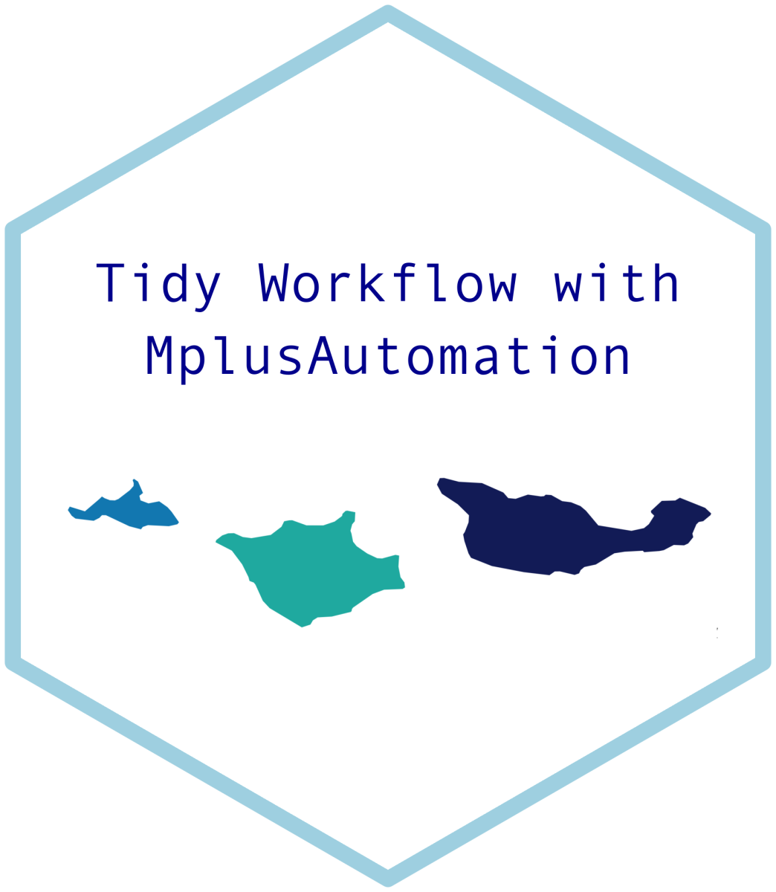

# 3-Step ML Auxiliary Variable Integration Using MplusAutomation

This R tutorial automates the 3-step ML axiliary variable procedure using the MplusAutomation package (Hallquist & Wiley, 2018) to estimate models and extract relevant parameters. To learn more about auxiliary variable integration methods and why multi-step methods are necessary for producing un-biased estimates see Asparouhov & Muthén (2014).

The motivation for writing this tutorial is that conducting the 3-step manually is highly error prone as it requires pulling logit values estimated in the step-1 model and adding them in the model statement of the step-2 model (i.e., lots of copying & pasting). In contrast, this approach is fully replicable and provides clear documentation which translates to more reliable research.

***

If using this tutorial to produce tables for publication it would be greatly appreciated if you cite this resource using the citation provided here:

Garber, A. C. (2021). 3-Step ML Auxiliary Variable Integration Using MplusAutomation. Retrieved from
https://psyarxiv.com/phtxa/

***

personal website - https://www.adam-garber.com/

